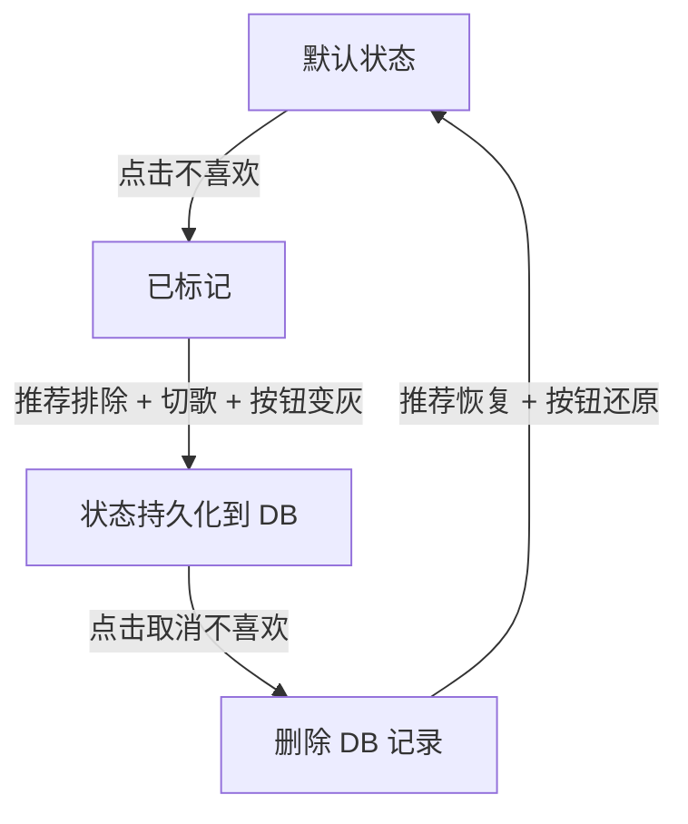

# 不喜欢（Dislike）功能

> 状态：✅ 已实现 · 实施日期：2026-07-05

## 概述

用户可以在任意歌曲列表或播放器底栏点击「不喜欢」按钮，将该歌曲标记为不喜欢。标记后：
- 歌曲从推荐结果中排除
- 如果当前正在播放该歌曲，自动切到下一首
- 按钮图标从空心破碎心变为实心灰色破碎心

## 生命周期：标记 vs 取消

### 点击「不喜欢」后的影响

| 影响 | 机制 | 范围 |
|------|------|------|
| 🔴 推荐排除 | 推荐引擎加载 `dislikedKeys`，遇到则 `continue` 跳过 | 仅 `/stats/recommend` |
| ⏭️ 自动切歌 | 如果当前正在播放 → `playNext(false)` | 仅当前播放的歌 |
| 💾 永久记录 | POST → `blocked_sources`（`source_type='song'`） | 服务端 SQLite，跨会话 |
| 🎨 按钮变色 | 图标空心→实心灰，斜线→深灰 `#6b6b6b` | 播放器 + 所有列表行 |

**不会发生**：
- ❌ 歌曲不会从歌单/队列/搜索结果中消失——仍然可见、可播放
- ❌ 不会删除任何用户数据（歌单、播放记录、红心都在）

### 取消不喜欢 → 完全可恢复

取消时 `DELETE FROM blocked_sources`，所有影响撤销：

| 影响 | 恢复状态 |
|------|:--:|
| 推荐排除 | ✅ 恢复——下次请求不再跳过 |
| 按钮状态 | ✅ 恢复——图标还原空心 |
| 数据库 | ✅ 删除记录，无残留 |
| 之前的切歌 | ⚠️ 歌仍在队列中，但需手动切回（不自动恢复播放） |



## API 端点

### `GET /stats/disliked-songs`

查询用户所有不喜欢的歌曲。

响应：
```json
{ "disliked": ["晴天__周杰伦", "七里香__周杰伦"] }
```

### `POST /stats/disliked-songs`

切换一首歌的不喜欢状态（点一下标记，再点取消）。

请求：
```json
{ "song_key": "晴天__周杰伦" }
```

响应（标记）：
```json
{ "disliked": true }
```
响应（取消）：
```json
{ "disliked": false }
```

## 数据存储

复用 `blocked_sources` 表，使用专用字段组合：

| 列 | 值 |
|---|----|
| `user_id` | 用户 ID |
| `song_key` | `歌名__歌手`（如 `晴天__周杰伦`） |
| `source_type` | `'song'`（区分于 `'video'` / `'lyrics'` 源屏蔽） |
| `source_id` | `'disliked'`（固定值） |
| `blocked_at` | 操作时间戳 |

## 状态模型

```js
// src/state.js
state.dislikedSongKeys = new Set()  // Set<string>，键格式: "歌名__歌手"
```

启动时通过 `GET /stats/disliked-songs` 加载，随后所有操作实时同步。

## SVG 图标

定义在 `src/utils.js`，统一管理避免重复：

| 常量 | 状态 | 效果 |
|------|------|------|
| `BROKEN_HEART_OUTLINE` | 默认 | 空心破碎心（`fill="none"`），斜线 `stroke="currentColor"` |
| `BROKEN_HEART_FILLED` | 已不喜欢 | 实心灰色心（`fill="currentColor"`），斜线 `stroke="#6b6b6b"` |

斜线使用固定灰 `#6b6b6b` 而非 CSS 变量，确保深浅主题下都可见。

## UI 更新链路

```
用户点击按钮 → toggleDislike(song, btn)
  ├─ POST /stats/disliked-songs
  ├─ state.dislikedSongKeys.add/delete
  ├─ updateDislikeBtnSVG(btn, disliked)
  │   ├─ npDislikeBtn → innerHTML = BROKEN_HEART_FILLED/OUTLINE
  │   └─ 列表行按钮 → setAttribute('fill', ...) + setAttribute('stroke', ...)
  ├─ toast('已标记为不喜欢' / '已取消不喜欢')
  └─ isCurrent → updateNpDislikeBtn() + playNext(false)
```

### 双向同步

| 触发位置 | 播放器按钮 | 列表行按钮 |
|---------|:---:|:---:|
| 播放器点 dislike | ✅ 直接更新 | ⚠ 切歌后重渲染 |
| 列表行点 dislike | ✅ `isCurrent` 触达 | ✅ 直接更新 |

## 与推荐引擎的交互

`server/routes/stats.js` 中 `/stats/recommend` 在候选过滤阶段加载 `dislikedKeys`：

```js
const dislikedKeys = new Set(
  db.prepare('SELECT song_key FROM blocked_sources WHERE user_id=? AND source_type=?')
    .all(uid, 'song').map(r => r.song_key)
);
// ...
if (dislikedKeys.has(key)) continue;
```

## CSS

```css
/* 不喜欢按钮激活态：图标颜色变为次要灰色（变暗但不消失） */
#npDislikeBtn.disliked-active,
.np-act-btn.disliked-active { color: var(--text-dim); }
```

### 视觉效果对照

| 状态 | 播放器 | 列表行 |
|------|--------|--------|
| 默认 | 空心心形 + 斜线，`fill="none"` | 同左（15px） |
| 已不喜欢 | 实心灰心 `fill="currentColor"` + 深灰斜线 `#6b6b6b` | 同左（15px） |

## 相关文件

| 文件 | 角色 |
|------|------|
| `src/state.js` | `dislikedSongKeys` Set |
| `src/utils.js` | `BROKEN_HEART_OUTLINE` / `BROKEN_HEART_FILLED` 常量 |
| `src/ui.js` | `toggleDislike()` / `updateNpDislikeBtn()` / `updateDislikeBtnSVG()` / `loadDislikedSongs()` / `initUI()` 绑定 |
| `src/playlist-ui.js` | `renderSongList()` 渲染 dislike 按钮 + handler |
| `src/player.js` | `playCurrent()` 切歌时刷新 dislike 按钮 |
| `src/main.js` | 启动时 `loadDislikedSongs()` |
| `server/routes/stats.js` | `GET/POST /stats/disliked-songs` + 推荐引擎过滤 |
| `public/css/style.css` | `.disliked-active` 样式 |
